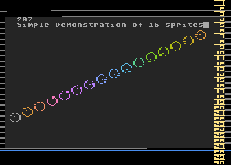
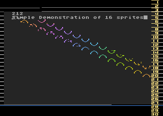
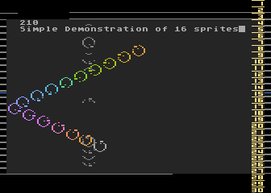

= Atari 8bit

The good old Atari 8bit hardware has the possibility to show some extra graphics objects called player missiles. They are independent of the current screen. But there exist a silly limit of 4 player and 4 missile graphics at the same time.
With some tricks it is possible to show more, but most the time these tricks are not as flexible as desired. Shanti77/tebe has developed an algorithm to change this for 3 color players but in a complex manner.

Here I use a self downgraded implementation based on Shanti77/tebes code but use only single color sprites. I will show you a way how you can use it in your own code.

This is a simple demonstration, how to show 16 animated single color sprites within the 4 player missile graphics (PMG) without flickering as long as no more than 4 players are displayed in the same horizontal line. It uses only the 4 players and no missiles.



To start the demo, take the DEMO.XEX file from the release sub-folder and use an emulator like atari800 or Altirra. (Links are below)

== Licenses
Some stuff here is downloaded from AtariWiki and is licensed under
https://creativecommons.org/licenses/by-sa/2.5/[Creative Commons Licenses]

== build

To build from scratch, stay in root folder and execute `make` from a unix-shell, **but** there are some _preconditions_ for the build environment.
On Windows use something like git-bash or mingw. On Linux use a bash.

=== Preconditions to build

You need some stuff for build from scratch

* PC with a unix based environment like Linux or Windows with mingw. Or a Mac. I prefer Linux.
* Bash Shell **/bin/bash**
* **make** to handle the Makefile
- To build this source from scratch
* **OpenJDK 11** for the wnf.compiler and the xldir tool

To simplify the installation, call the `get-everything.sh` script, this will get the wnf.compiler jar file and the xldir jar file as ATR disk image tool from github and install it to the local directory `compiler/bin`. The path in Makefile is set to the compiler/bin directory.

* Take this assembler: https://github.com/CycoPH/atasm[**atasm**] the 6502-cross-assembler, to create COM-files out of ASM-files,
because the wnf.compiler only creates assembler files. You need at least Version 1.18 of the atasm assembler.
* the http://www.emulators.com/freefile/pcxf380.zip[**ATARIXL.ROM**], copy the XL-OS to `firmware` folder.
* https://atari800.github.io/index.html[**atari800**] Emulator is need. Make it available via $PATH variable.

If you would like to debug the code, use the https://virtualdub.com/altirra.html[**Altirra**] Emulator and start `make debug` on console. In the Makefile find in line 5 the ALTIRRA= expression, set it to your installed Altirra version. Here you can see how to use it with Wine.

The `get-everything.sh` is idempotent, if there are errors, fix it and start the script again.

== Demo description:


On this image you see a Graphics 0 screen in dark gray (poke 710,2) with text and 16 sprites(!) in 16 colors, these little balls. Every sprite looks a little bit different. At the demo you see a simple small rotation with 16 different images.
See at file `sprite-data.wnf`, here you find the sprite data in 16 different versions.
The source code contains the data in byte arrays 16 bytes long, formatted with in binary values, starts by '%' character and 8 digits of 0 or 1. The wnf.compiler interprets a '.' as 0, for better notion.
One point, the @ in front of each array name is very important for the wnf.compiler it marks variable names as global viewable names.

You see also a lot of small gray lines, left and right. This should show, where the important Displaylist Interrupts occur.

On the right of the image you see a tape measure 1-30, this is a PMG Missile. Within this powerful multi sprite algorithm, the screen is split into block lines of 8 screen lines. The line over the small PMG numbers should show the important 'meter' number.

This meter number has to set to the block value where the first DLI starts. Here in this demo the value is 3. So in the file `multi-sprite-dli.INC` the meter value has to set to the block value where the first DLI occurs. This meter number has to reset every VBI to the value of 3.

=== What is need:
* Set every 8 screen lines an DLI interrupt in your Displaylist.
See file `displaylist.INC`. This is a Graphics 0 like displaylist, nearly every element contains `DL_DLI` to say here a DLI should occur. The variable definition DL_* based on `atari_antic.inc` of the cc65 project to simply create displaylists.

* The displaylist will be reset by a VBI. To initialise this VBI, call `@init_vbi()`. Found it in the file `dli.INC`. Find here also the DLI. It will be called very often, every 8th screen line.
Within a DLI simply call `jsr @multi_sprite_dli_sub`. Here it is possible to add some stuff to your own DLI also.

* Call every 1/50s the function `@show_sprites()`, but this must start outside the last DLI interrupt, so wait for the appropriate line with `@waitline(n)`. This is a function to wait until VCOUNT==n. Here we wait for VCOUNT=112.

* You must know, at which position the first DLI starts. This should be at a position of factor 8 screen lines. Take a look at the tape measure and set the meter value.

Next image shows, what happend if the meter number is not set to the right value.



In this demo, every DLI is made visible by a gray line on the left/right background screen frame. In file `dli.INC` find:
```[assembler]
  lda #8
  sta colbk
  [...]
  lda #0
  sta colbk
```

The blue line at the button marks the line at which the 'show_sprites()' function should early call. If you call the function earlier this will result in strange display errors.



The pictures are made with Altirra emulator on a PAL machine. Within NTSC machines this demo runs also, but there are some trouble with the 16 sprites. Also the tape measure runs on NTSC only from 2 - 29.

**Tip:** Due to the more interrupts on NTSC machines and the less time for drawing so many sprites, use less sprites on NTSC like 14 or 12.

In the animation the balls will only flicker, if the algorithm try to show more than 4 sprites in a line not else.

On point, sprite 0 will never flicker, use it for your own figure.

==== Advantage
The advantage of this algorithm are:

* You do not require any extra thing to display many sprites, more than the default 4.
On a somewhat restricted area.
* Only the sprite position as x,y the sprite color and an index to the sprite data has to set, if a change on a sprite is need.
* For animations you are on your own. But you only need to change the sprite number which should be displayed. There is no restriction as long as you not plan to use more than 256 different sprites.
* 256 different sprites eats only 4kb memory + 512 byte in the all-sprites table.

==== Disadvantages

* Eats a lot of performance for sprite drawing, but you should have enough for your game.
* `@show_sprites()` must be called every 1/50s after your screen play field or no sprites will be displayed at all.
* Only 256 different sprites are possible without fat changes in this code due to the splitted byte arrays for faster access. But also in big programs for the Atari 8bit 256 sprites should be completely sufficient. Night Knight needs less than 128 sprites.
* You are limited to 16 bytes for a sprite height.
* With this algorithm the 3 color trick with the PMG will not work. You will never know which player number will currently use to show a sprite.
* You cannot display sprites outside of the area drawn by the DLIs.
* Collision detection is a little bit special, because you can't recognize which player is currently representing which sprite. Only sprite 0 is yours. +

**Tip:** If you would like to use more colors for your figure, use more sprites and do not overlay bits in the sprite graphics or you will get in trouble with collision detection. Also here 3 color PMG trick will not work.


== The files:

`demo-16-sprites.wnf`::
Find here the main routine. The `*.wnf` files are written in 'wnf' language which is an Algol/Action! equal language for the Atari 8bit computer. A compiler language as easy as basic but as fast as assembler.

All the next files will be included by the above file.

`all-sprites.wnf`::
Contains only the "pointers" to the sprite data in `sprite-data.wnf`. Every entry in such word array points to another sprite. The multiplexer reads sprite_shape[n] value and take the data out of the '@all_sprite_data_table[value]' array. This is a word array, but internally for faster access it will produce 2 byte arrays. One byte array for the low values, and one byte array for the high values. It is a nice feature of the wnf.compiler.

`sprite-data.wnf`::
Contains the single sprites, every sprite in an own byte array. The name of the arrays here are stored in the above 'all_sprite_data_table array'. You will also find the tape measure values here.

`displaylist.INC`::
A Displaylist like Graphics 0, but nearly every line has a DLI. Important, the DLI should occur at align 8 lines, or it will get complicated.

`dli.INC`::
The VBI which set the Displaylist, set the DLI and reset the meter value.
You find the DLI jump in here also. The DLI will `jsr` into the `multi-sprite-dli.INC`

`multi-sprite-dli.INC`::
Contains the DLI to handle the sprites. Find the `@reset_meter` function here also which reset the 'meter' value to number where the first DLI occurs. See the 'tape measure' for the first gray line.

`multi-sprite-multiplexer.INC`::
Contains the multiplexer routine to sort the multi sprites down to the 4 Atari PMG Graphics. This source code uses a lot of unroll loop code, to make it very fast.

To build and run the demo code, just type `make` in your console.
After make is done, there exists a lot of *.ASM files, because the wnf.compiler produce Assembler files and not a ready to use executable. Here you can take a look also, how to build such system in assembler.

== Conclusion

This algorithm really eats up a lot of performance and is a bit complicated to configure,
but it brings you the possibility to display more than 4 sprites at the same time in a very simple and flexible manner.

Only if more than 4 sprites has to show in a horizontal line the sprites will flicker not else.

Be sure, most the time you need round about 8 to 12 sprites and not more.

From now on, I'm expecting new Atari games with more than 4 sprites at the same time. The costs of performance are high, but very well invested.

Big thanks to shanti77/tebe on which this nice algorithm based.
